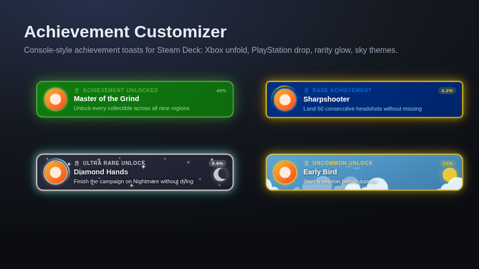

# Achievement Customizer

A [Decky Loader](https://github.com/SteamDeckHomebrew/decky-loader) plugin that gives Steam Deck
achievement notifications the look and motion of console unlock toasts. The native Steam toast is
replaced in place, so there is nothing to time, nothing doubles up, and the same toast you preview
in the Quick Access menu is the one that shows up in game.



> Previously named *Xbox Achievements*. Existing settings are migrated automatically.

## Features

- **Entrance animations** — Unfold (Xbox: the icon disc pops in and the card unfolds out of it),
  Drop (PlayStation: settles in from above with a pass of light around the icon), Slide, Pop,
  Bounce and Fade. Slides come from whichever screen edge Steam places toasts on.
- **Presets** — Xbox, PlayStation, Steam, Nintendo, Gold, Midnight, Sky Day, Sky Night, each with
  its own colors, shape and entrance.
- **Rarity** — the global unlock percentage is shown on every toast; unlocks under 10% get a gold
  ring and glow, under 1% a diamond one. Under 25% is called out as uncommon.
- **Progress toasts** — partial achievement progress shows an animated bar instead of a description.
- **Decorations** — Sparkles, a drifting daytime sky with sun and clouds, or a night sky with
  twinkling stars, constellations and a crescent moon.
- **Full control** — primary, secondary, accent, title and description colors; gradient, solid or
  glass banner; icon shape and border; corner rounding; glow intensity; shine sweep; duration.
- **Live preview and real test toasts** — the preview replays your changes as you make them, and the
  test buttons send genuine achievement notifications through Steam so the result is exactly what
  an unlock will look like (sound included, without cluttering the notification tray).
- Respects the system reduced-motion setting.

## Installation

It has not yet been reviewed or approved by the Decky-plugin developers. For the time being it is currently in development. 
```

## License

BSD-3-Clause. Built on the [decky-plugin-template](https://github.com/SteamDeckHomebrew/decky-plugin-template);
the original template license is preserved in `LICENSE`.
